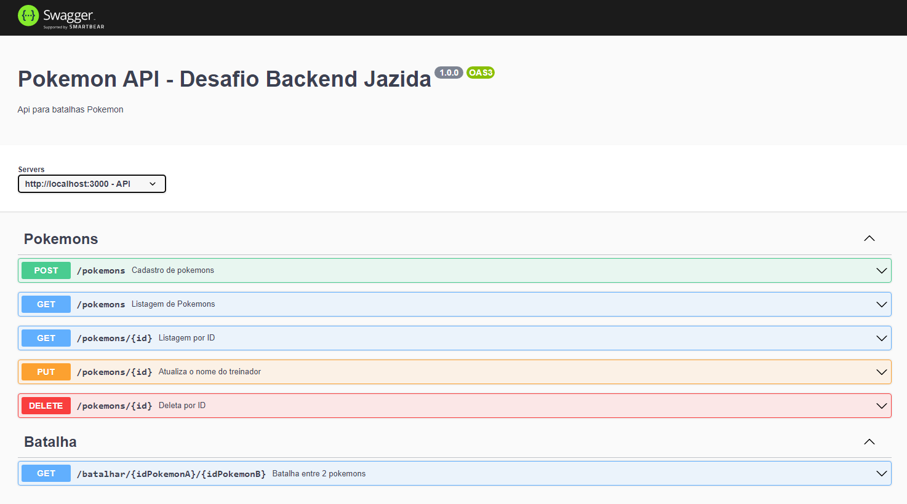
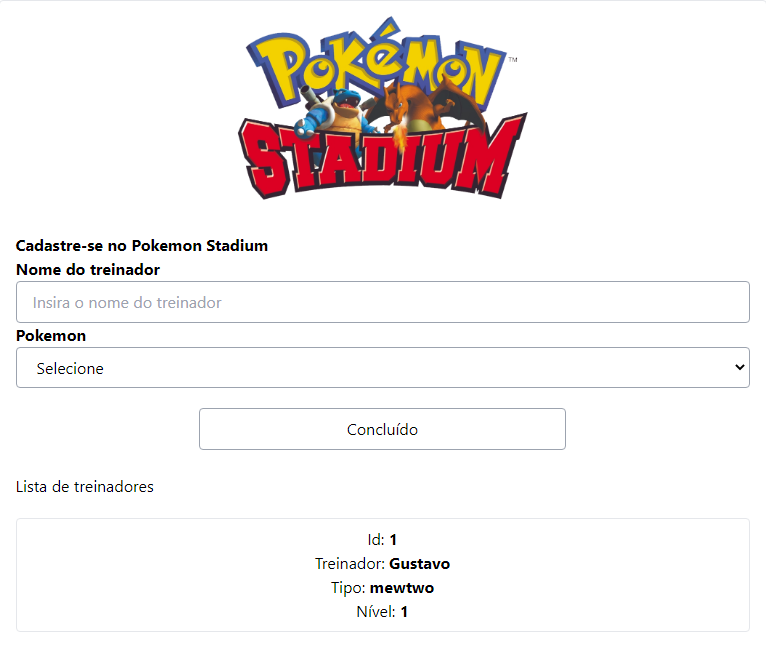
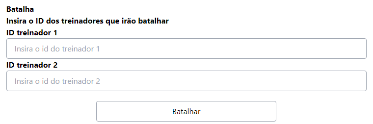

# Pokémon Stadium

Pokémon battle system, which allows you to register a trainer and battle. The battle system will calculate the pokemon's level and the highest pokemon will have 66% more chances to win the battle.

## Installation

```bash
npm install
```

## Running the app

```bash
# development
npm run start
# whatch mode
npm run dev
```

## Running the app with docker

After setting up the enviroment variables

```bash
docker-compose up
```

## Enviroment Variables

The example of env variables is available at the ".env.example" file.
The .env file is necessary before running the app.

## API Documentation

The API documentation using Swagger is available at the "/api-docs" route.


## Frontend project

The frontend for this app is available at [here](https://github.com/grmgustavo/frontent-pokemon-stadium).


